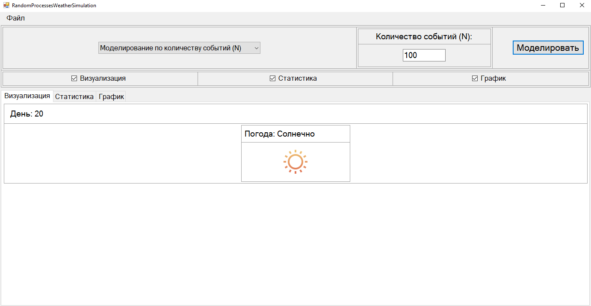
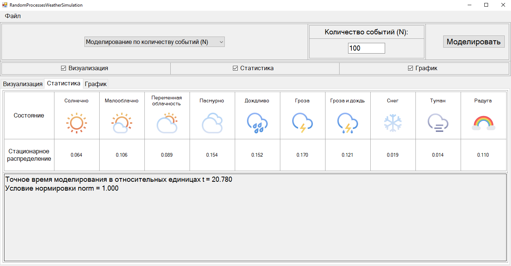
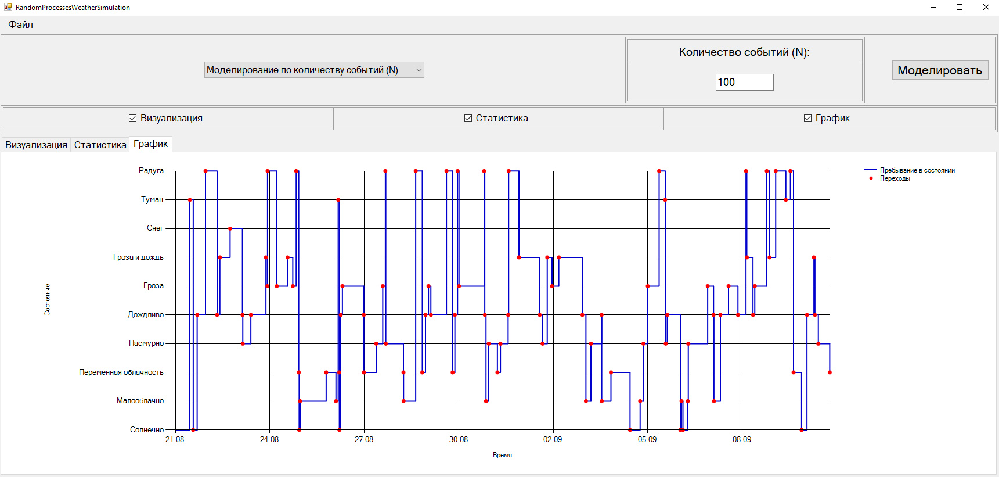

# 🌦 RandomProcessesWeatherSimulation

Simulation of random weather changes using **Continuous-Time Markov Chains (CTMC)**.  
Симуляция случайных изменений погоды с использованием **марковских цепей с непрерывным временем (CTMC)**.

---

## 📌 About / О проекте

🎓 Developed for a Simulation Modeling course.  
💡 Supports multiple weather states, real-time visualization, and statistical analysis.  
📦 Modular, extendable, bilingual (EN / RU).

🎓 Разработано в рамках курса «Моделирование процессов».  
💡 Поддержка нескольких состояний погоды, визуализация в реальном времени и статистический анализ.  
📦 Модульная, расширяемая, двуязычная архитектура.

---

## 🔧 Features / Возможности

- ☀️🌧 Multiple weather states (sunny, cloudy, rain, snow, etc.)  
  Несколько состояний погоды (солнечно, облачно, дождь, снег и др.)

- 🕒 Simulation by events (N) or by time (T)  
  Симуляция по количеству событий (N) или по времени (T)

- 📊 Real-time visualization and charts  
  Визуализация в реальном времени и построение графиков

- 📄 Display statistics: stationary probabilities, transitions  
  Отображение статистики: стационарные вероятности, переходы

- 🧩 Modular CTMC architecture  
  Модульная архитектура CTMC

---

## 📁 Structure / Структура

- `Form_Main.cs` — main WinForms UI + simulation logic  
  Главная форма WinForms + логика симуляции

- `SimulationEvent` — class for storing events (time & state)  
  Класс для хранения событий (время и состояние)

- `LoadQMatrixFromCsv()` — load intensity matrix Q from CSV  
  Загрузка матрицы интенсивностей Q из CSV

- `ValidateQMatrix()` — check correctness of Q matrix  
  Проверка корректности матрицы Q

- `CalculatePMatrix()` — compute transition probability matrix P  
  Расчёт матрицы вероятностей перехода P

- `Simulation()` — main simulation algorithm  
  Основной алгоритм симуляции

- `DrawState()` — display current weather state  
  Отображение текущего состояния погоды

- `ShowStatistics()` — display simulation statistics  
  Отображение статистики симуляции

- `DrawStateTimelineChart()` — plot transition timeline  
  Построение графика переходов состояний

---

## 🖼 Screenshots / Скриншоты

  
*Рис. 1 — Главное окно программы (Визуализация состояния погоды / Weather state visualization)*

  
*Рис. 2 — Главное окно программы (Стационарные вероятности / Stationary capabilities)*

  
*Рис. 3 — Главное окно программы (График переходов состояний / State transition chart)*

---

## 🎯 Goal / Цель проекта

- Study **random weather processes** via Markov chains.  
  Изучение случайных процессов погоды через марковские цепи.

- Implement **CTMC simulation** with visualization.  
  Реализация симуляции CTMC с визуализацией.

- Analyze **statistics of weather states**.  
  Анализ статистики состояний погоды.
